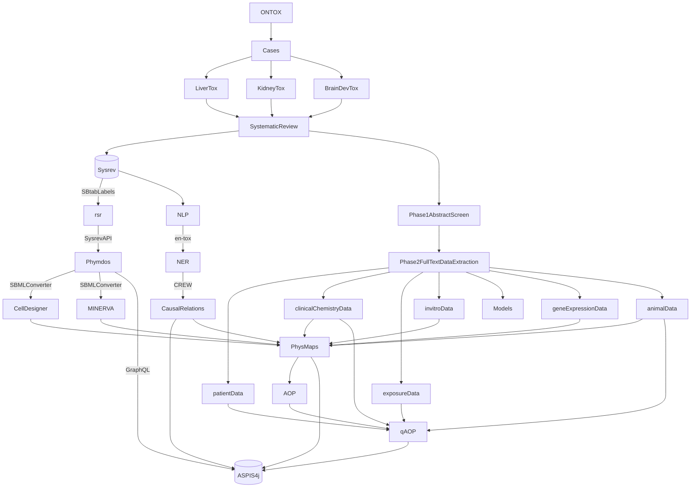

```mermaid
flowchart TD
  
  ONTOX-->Cases

  Cases-->LiverTox
  Cases-->KidneyTox
  Cases-->BrainDevTox
  
  LiverTox-->SystematicReview
  KidneyTox-->SystematicReview
  BrainDevTox-->SystematicReview
  
  SystematicReview-->Sysrev[(Sysrev)]
  
  Sysrev[(Sysrev)]-->|SBtabLabels| rsr
  rsr-->|SysrevAPI| Phymdos
  Phymdos-->|SBMLConverter| CellDesigner
  Phymdos-->|SBMLConverter| MINERVA
  Phymdos-->|GraphQL| ASPIS4j
  CellDesigner-->PhysMaps
  MINERVA-->PhysMaps
  
  
  SystematicReview-->Phase1AbstractScreen
  Phase1AbstractScreen-->Phase2FullTextDataExtraction
  Sysrev[(Sysrev)]-->NLP
  NLP-->|en-tox| NER
  NER-->|CREW| CausalRelations
  CausalRelations-->ASPIS4j[(ASPIS4j)]
  CausalRelations-->PhysMaps
  
  
  Phase2FullTextDataExtraction-->patientData
  Phase2FullTextDataExtraction-->clinicalChemistryData
  Phase2FullTextDataExtraction-->exposureData
  Phase2FullTextDataExtraction-->invitroData
  Phase2FullTextDataExtraction-->Models
  Phase2FullTextDataExtraction-->geneExpressionData
  Phase2FullTextDataExtraction-->animalData
  
  clinicalChemistryData-->PhysMaps
  invitroData-->PhysMaps
  geneExpressionData-->PhysMaps
  animalData-->PhysMaps
  exposureData-->qAOP
  clinicalChemistryData-->qAOP
  patientData-->qAOP
  animalData-->qAOP
  
  PhysMaps-->AOP-->qAOP
  qAOP-->ASPIS4j[(ASPIS4j)]
  PhysMaps-->ASPIS4j[(ASPIS4j)]
  
```
