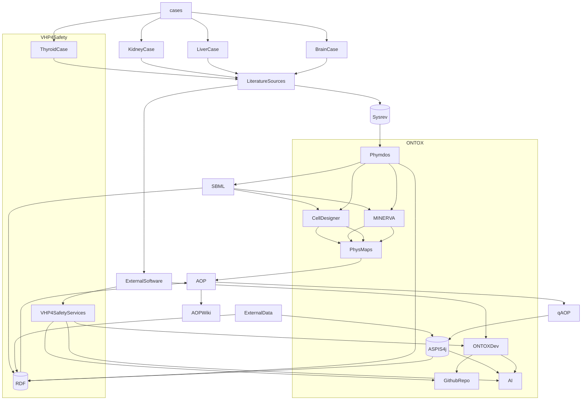

```mermaid
flowchart TB

    cases-->KidneyCase
    cases-->LiverCase
    cases-->BrainCase
    cases-->ThyroidCase
    
    KidneyCase-->LiteratureSources
    LiverCase-->LiteratureSources
    BrainCase-->LiteratureSources
    ThyroidCase-->LiteratureSources
    LiteratureSources-->Sysrev[(Sysrev)]
    Sysrev[(Sysrev)]-->Phymdos
    Phymdos-->SBML
    SBML-->CellDesigner
    SBML-->MINERVA
    SBML-->RDF[(RDF)]
    CellDesigner-->PhysMaps
    MINERVA-->PhysMaps
    PhysMaps-->AOP
    
 %%%%%%%%%%%%%%%%%%%%%%%%%%%%%%%
 
    subgraph ONTOX
    
    ONTOXDev
    ONTOXDev-->GithubRepo
    Phymdos-->MINERVA
    Phymdos-->CellDesigner
    CellDesigner-->PhysMaps
    MINERVA-->PhysMaps
    ASPIS4j[(ASPIS4j)]-->AI
    
    end
 
 %%%%%%%%%%%%%%%%%%%%%%%%%%%%%%%%
 
    subgraph VHP4Safety
    
    ThyroidCase 
    Phymdos-->RDF[(RDF)]
    VHP4SafetyServices
    VHP4SafetyServices-->AI
    ONTOXDev-->AI
    VHP4SafetyServices-->GithubRepo
    
    
    end
    
 %%%%%%%%%%%%%%%%%%%%%%%%%%%%%%%%%%
 
    RDF[(RDF)]-->AOP
    AOP-->AOPWiki
    VHP4SafetyServices-->ONTOXDev
    AOP-->qAOP
    LiteratureSources-->ExternalSoftware
    ExternalSoftware-->VHP4SafetyServices
    ExternalSoftware-->ONTOXDev
    ExternalData-->ASPIS4j[(ASPIS4j)]
    qAOP-->ASPIS4j[(ASPIS4j)]
    ASPIS4j[(ASPIS4j)]-->RDF[(RDF)]
    ExternalData-->RDF[(RDF)]
    
    
```
