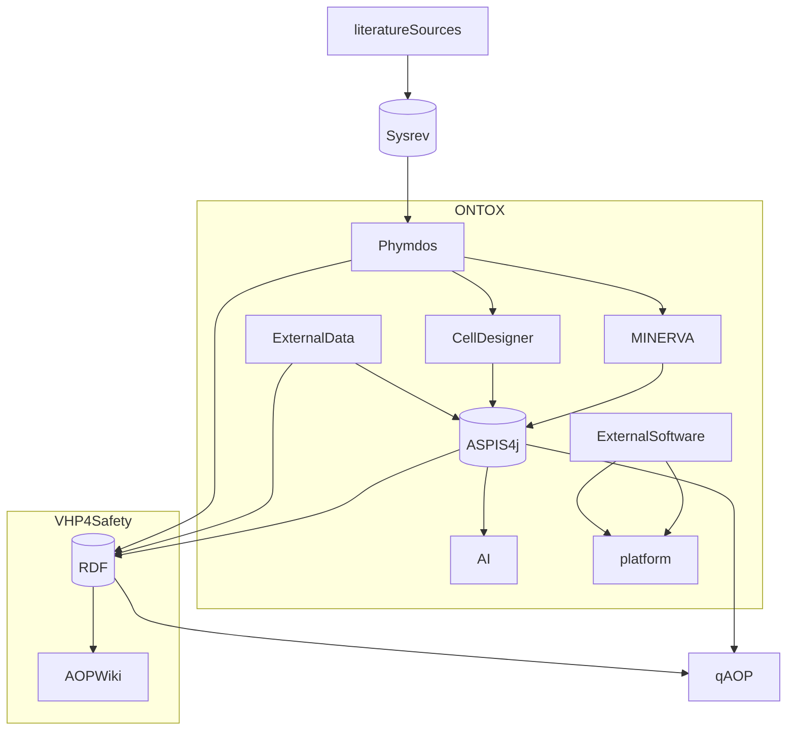

```mermaid
flowchart TB
    literatureSources-->Sysrev[(Sysrev)]
    Sysrev[(Sysrev)]-->Phymdos
    
    subgraph ONTOX
    Phymdos-->MINERVA
    Phymdos-->CellDesigner
    ExternalData-->ASPIS4j[(ASPIS4j)]
    CellDesigner-->ASPIS4j[(ASPIS4j)]
    MINERVA-->ASPIS4j[(ASPIS4j)]
    ASPIS4j[(ASPIS4j)]-->AI
    ExternalSoftware-->platform
    end
    
    
    subgraph VHP4Safety
    Phymdos-->RDF[(RDF)]
    RDF[(RDF)]-->AOPWiki
    ExternalData-->RDF[(RDF)]
    ExternalSoftware-->platform
    end
    RDF[(RDF)]-->qAOP
    ASPIS4j[(ASPIS4j)]-->qAOP
    ASPIS4j[(ASPIS4j)]-->RDF[(RDF)]
    
    
    
```
