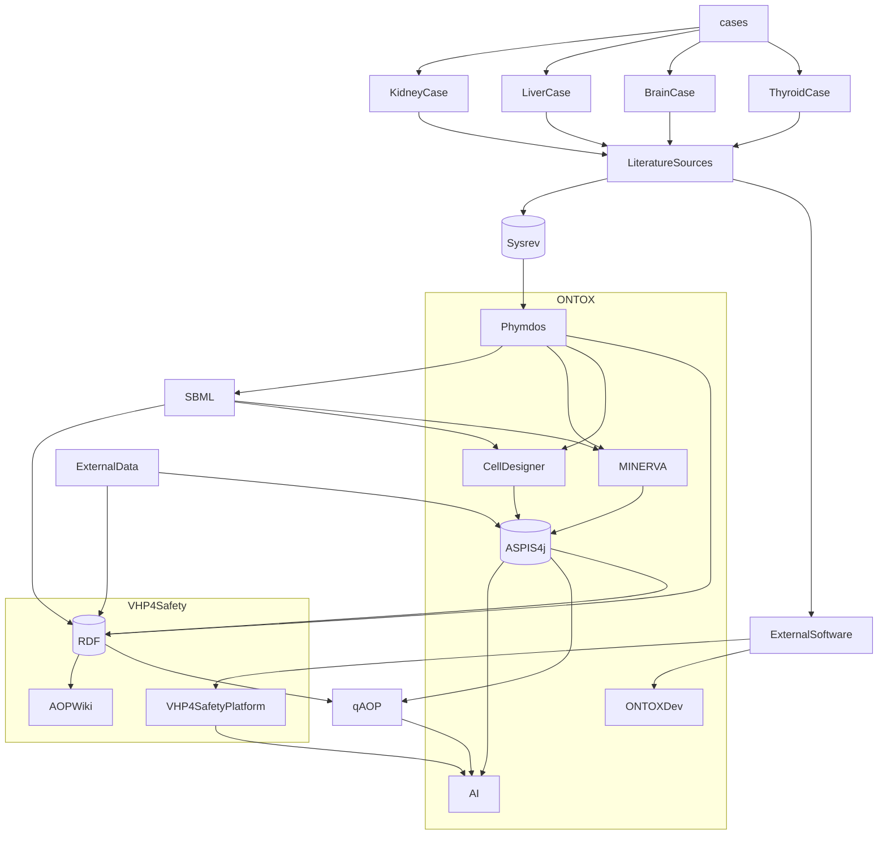

```mermaid
flowchart TB

    cases-->KidneyCase
    cases-->LiverCase
    cases-->BrainCase
    cases-->ThyroidCase
     
    KidneyCase-->LiteratureSources
    LiverCase-->LiteratureSources
    BrainCase-->LiteratureSources
    ThyroidCase-->LiteratureSources
    LiteratureSources-->Sysrev[(Sysrev)]
    Sysrev[(Sysrev)]-->Phymdos
    Phymdos-->SBML
    SBML-->CellDesigner
    SBML-->MINERVA
    SBML-->RDF[(RDF)]
    
    subgraph ONTOX
    ONTOXDev
    Phymdos-->MINERVA
    Phymdos-->CellDesigner
    
    CellDesigner-->ASPIS4j[(ASPIS4j)]
    MINERVA-->ASPIS4j[(ASPIS4j)]
    ASPIS4j[(ASPIS4j)]-->AI
    
    end
    
    
    subgraph VHP4Safety
    Phymdos-->RDF[(RDF)]
    RDF[(RDF)]-->AOPWiki
    
    VHP4SafetyPlatform
    VHP4SafetyPlatform-->AI
    end
    
    LiteratureSources-->ExternalSoftware
    ExternalSoftware-->VHP4SafetyPlatform
    ExternalSoftware-->ONTOXDev
    ExternalData-->ASPIS4j[(ASPIS4j)]
    RDF[(RDF)]-->qAOP
    ASPIS4j[(ASPIS4j)]-->qAOP
    ASPIS4j[(ASPIS4j)]-->RDF[(RDF)]
    ExternalData-->RDF[(RDF)]
    qAOP-->AI
    
    
```
