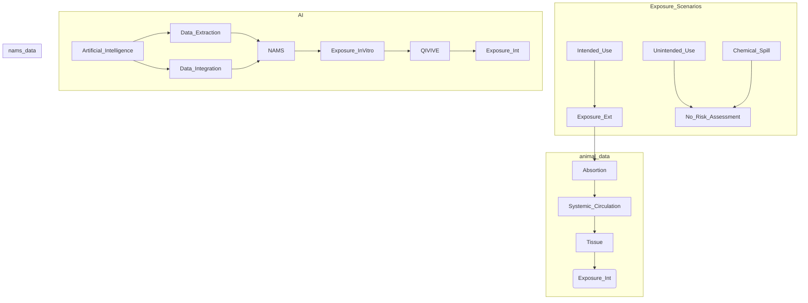

```mermaid
flowchart TD


  subgraph Exposure_Scenarios
  
  Intended_Use-->Exposure_Ext
  Unintended_Use-->No_Risk_Assessment
  Chemical_Spill-->No_Risk_Assessment
  
  end

  %%%%%%%%%%%%%%%%%%%%%%%%%%%%%%%%%%%%%%%%%%%%%%%%%%%

  subgraph AI

  Artificial_Intelligence-->Data_Extraction
  Data_Extraction-->NAMS
  Artificial_Intelligence-->Data_Integration
  Data_Integration-->NAMS
  Exposure_InVitro-->QIVIVE
  QIVIVE-->Exposure_Int
  
  end
  
  %%%%%%%%%%%%%%%%%%%%%%%%%%%%%%%%%%%%%%%%%%%%%%%%%
  
  subgraph animal_data
  
  Exposure_Ext-->Absortion
  Absortion-->Systemic_Circulation
  Systemic_Circulation-->Tissue
  Tissue-->Exposure_Int_/\_(Exposure_Int)
  
  end
  
  %%%%%%%%%%%%%%%%%%%%%%%%%%%%%%%%%%%%%%%%%%%%%%%%%%
  
  subgraph nams_data
  
  NAMS-->Exposure_InVitro
  
  end
  
  %%%%%%%%%%%%%%%%%%%%%%%%%%%%%%%%%%%%%%%%%%%%%%%%%%%
  
```

