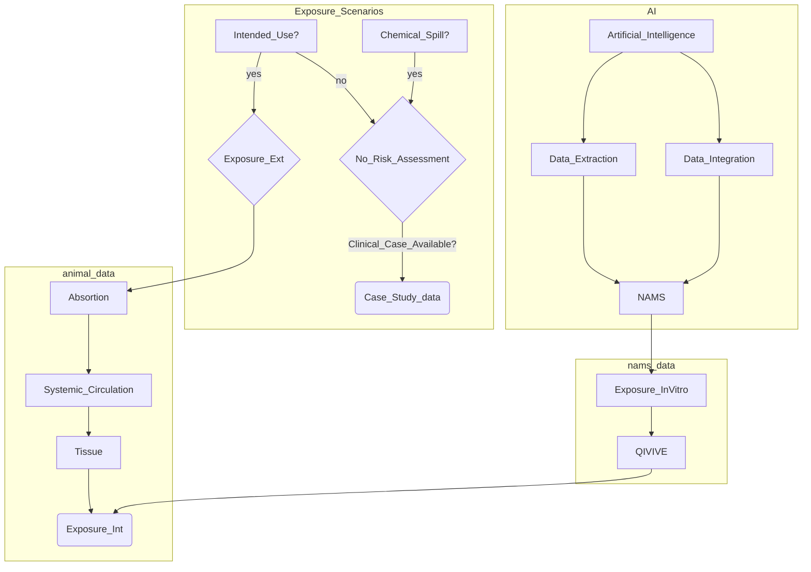

```mermaid
flowchart TD


  subgraph Exposure_Scenarios
  
  Intended_Use?-->|yes| Exposure_Ext{Exposure_Ext}
  Intended_Use?-->|no| No_Risk_Assessment{No_Risk_Assessment}
  Chemical_Spill?-->|yes| No_Risk_Assessment{No_Risk_Assessment}
  No_Risk_Assessment{No_Risk_Assessment}--> |Clinical_Case_Available?| Case_Study_Data(Case_Study_data)
  
  
  
  end

  %%%%%%%%%%%%%%%%%%%%%%%%%%%%%%%%%%%%%%%%%%%%%%%%%%%

  subgraph AI

  Artificial_Intelligence-->Data_Extraction
  Data_Extraction-->NAMS
  Artificial_Intelligence-->Data_Integration
  
  end
  
  %%%%%%%%%%%%%%%%%%%%%%%%%%%%%%%%%%%%%%%%%%%%%%%%%
  
  subgraph animal_data
  
  Exposure_Ext-->Absortion
  Absortion-->Systemic_Circulation
  Systemic_Circulation-->Tissue
  Tissue-->Exposure_Int(Exposure_Int)
  
  end
  
  %%%%%%%%%%%%%%%%%%%%%%%%%%%%%%%%%%%%%%%%%%%%%%%%%%
  
  subgraph nams_data
  
  NAMS-->Exposure_InVitro
  Data_Integration-->NAMS
  Exposure_InVitro-->QIVIVE
  QIVIVE-->Exposure_Int
  
  end
  
  %%%%%%%%%%%%%%%%%%%%%%%%%%%%%%%%%%%%%%%%%%%%%%%%%%%
  
```

