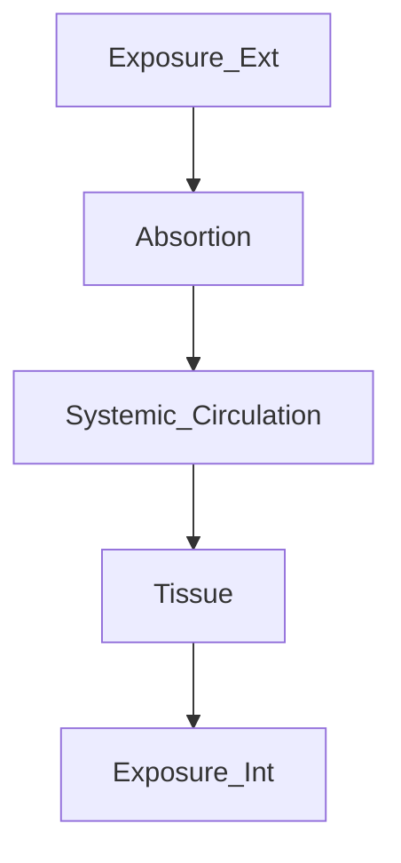

var mermaidAPI = mermaid.mermaidAPI;

mermaidAPI.initialize({
  startOnLoad:false
});

var element = document.getElementById("app");
var insertSvg = function(svgCode, bindFunctions) {
  element.innerHTML = svgCode;
};
var graphDefinition = `graph LR; Systemstart-->SomeIcon()`;
var graph = mermaidAPI.render("mermaid", graphDefinition, insertSvg);

