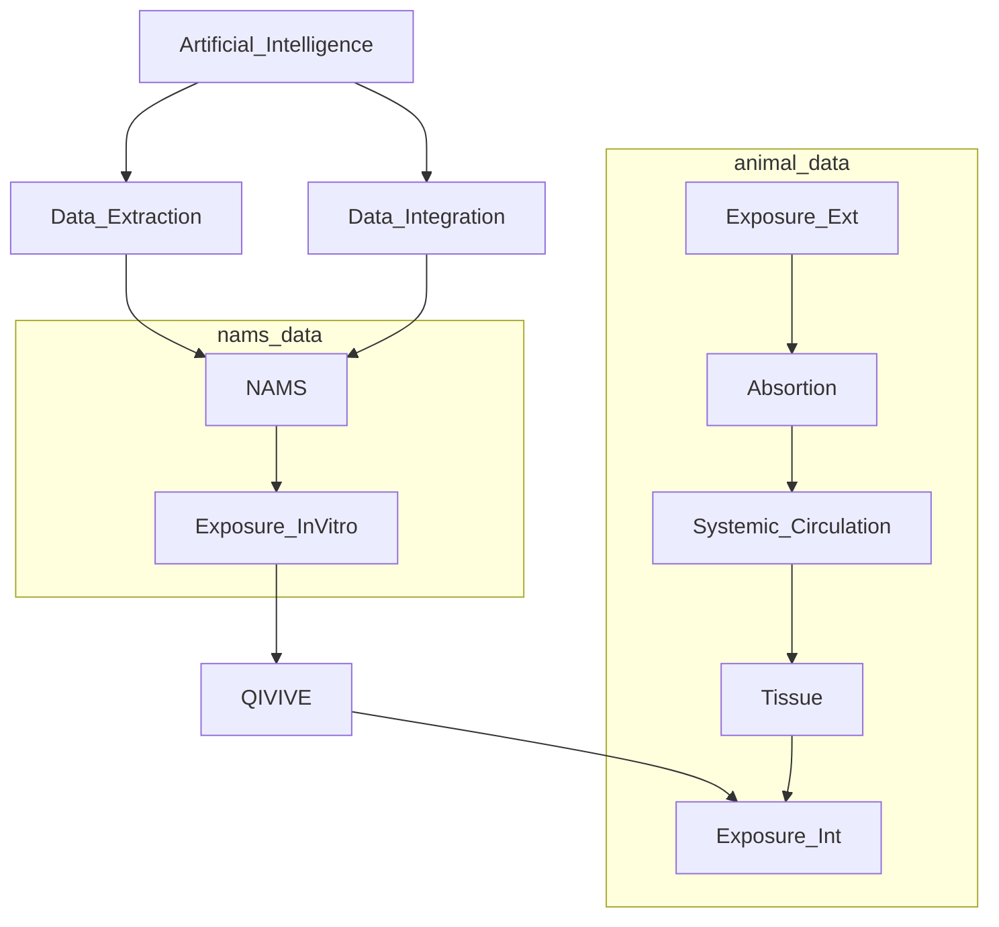

```mermaid
flowchart TD

  Artificial_Intelligence-->Data_Extraction
  Data_Extraction-->NAMS
  Artificial_Intelligence-->Data_Integration
  Data_Integration-->NAMS
  Exposure_InVitro-->QIVIVE
  QIVIVE-->Exposure_Int
  
  subgraph animal_data
  
  Exposure_Ext-->Absortion
  Absortion-->Systemic_Circulation
  Systemic_Circulation-->Tissue
  Tissue-->Exposure_Int
  
  end

  subgraph nams_data
  
  NAMS-->Exposure_InVitro
  
  end
  
```

