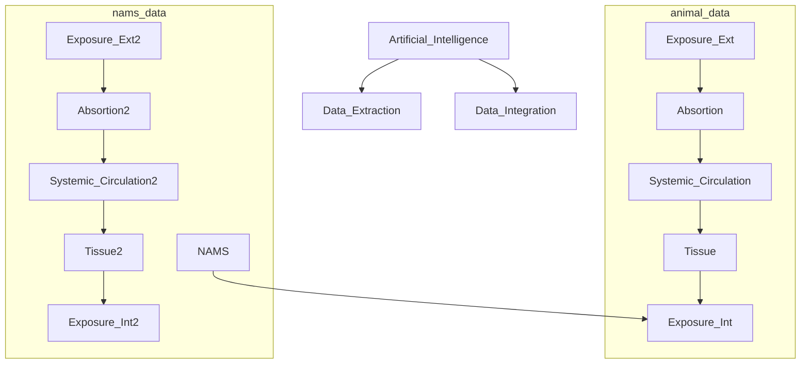

```mermaid
flowchart TD

  Artificial_Intelligence-->Data_Extraction
  Artificial_Intelligence-->Data_Integration

  subgraph animal_data
  
  Exposure_Ext-->Absortion
  Absortion-->Systemic_Circulation
  Systemic_Circulation-->Tissue
  Tissue-->Exposure_Int
  
  end

  subgraph nams_data
  
  NAMS-->Exposure_Int
  Exposure_Ext2-->Absortion2
  Absortion2-->Systemic_Circulation2
  Systemic_Circulation2-->Tissue2
  Tissue2-->Exposure_Int2
  
  end
  
```

