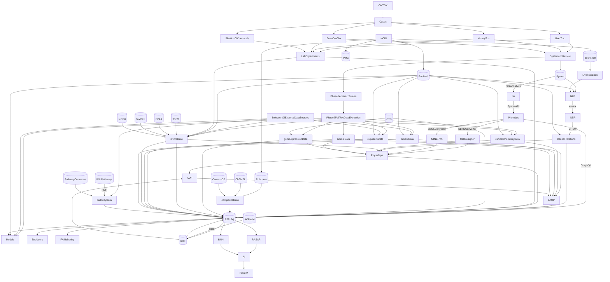

```mermaid
graph TD
  
  ONTOX-->Cases

  Cases-->LiverTox
  Cases-->KidneyTox
  Cases-->BrainDevTox
  
  LiverTox-->SystematicReview
  KidneyTox-->SystematicReview
  BrainDevTox-->SystematicReview
  
  SystematicReview-->Sysrev[(Sysrev)]
  
  Sysrev[(Sysrev)]-->|SBtabLabels| rsr
  rsr-->|SysrevAPI| Phymdos
  Phymdos-->|SBMLConverter| CellDesigner
  Phymdos-->|SBMLConverter| MINERVA
  Phymdos-->|GraphQL| ASPIS4j
  CellDesigner-->PhysMaps
  MINERVA-->PhysMaps
  
  
  SystematicReview-->Phase1AbstractScreen
  Phase1AbstractScreen-->Phase2FullTextDataExtraction
  Sysrev[(Sysrev)]-->NLP
  NLP-->|en-tox| NER
  NER-->|CREW| CausalRelations
  CausalRelations-->ASPIS4j[(ASPIS4j)]
  CausalRelations-->PhysMaps
  
  
  Phase2FullTextDataExtraction-->patientData
  Phase2FullTextDataExtraction-->clinicalChemistryData
  Phase2FullTextDataExtraction-->exposureData
  Phase2FullTextDataExtraction-->invitroData
  Phase2FullTextDataExtraction-->Models
  Phase2FullTextDataExtraction-->geneExpressionData
  Phase2FullTextDataExtraction-->animalData
  
  clinicalChemistryData-->PhysMaps
  invitroData-->PhysMaps
  geneExpressionData-->PhysMaps
  animalData-->PhysMaps
  exposureData-->qAOP
  clinicalChemistryData-->qAOP
  patientData-->qAOP
  animalData-->qAOP
  
  PhysMaps-->AOP-->qAOP
  qAOP-->ASPIS4j[(ASPIS4j)]
  PhysMaps-->ASPIS4j[(ASPIS4j)]
  
  SelectionOfExternalDataSources-->patientData
  SelectionOfExternalDataSources-->clinicalChemistryData
  SelectionOfExternalDataSources-->exposureData
  SelectionOfExternalDataSources-->invitroData
  SelectionOfExternalDataSources-->Models
  SelectionOfExternalDataSources-->pathwayData
  
  NCBI-->PubChem[(PubChem)]
  NCBI-->PubMed[(PubMed)]
  NCBI-->Bookshelf[(Bookshelf)]
  NCBI-->PMC[(PMC)]
  PubMed[(PubMed)]-->patientData
  PubMed[(PubMed)]-->clinicalChemistryData
  PubMed[(PubMed)]-->exposureData
  PubMed[(PubMed)]-->invitroData
  PubMed[(PubMed)]-->Models
  PubMed[(PubMed)]-->CausalRelations
  PubMed[(PubMed)]-->NLP
  
  LiverTox-->LabExperiments
  KidneyTox-->LabExperiments
  BrainDevTox-->LabExperiments
  LabExperiments-->invitroData
  
  Cases-->SlectionOfChemicals-->LabExperiments
  LabExperiments-->ASPIS4j[(ASPIS4j)]
  
  CTD[(CTD)]-->geneExpressionData
  CTD[(CTD)]-->ASPIS4j[(ASPIS4j)]
  Tox21[(Tox21)]-->invitroData
  EPAA[(EPAA)]-->invitroData
  ToxCast[(ToxCast)]-->invitroData
  NCI60[(NCI60)]-->invitroData
  PubChem[(Pubchem)]-->compoundData
  ChEMBL[(ChEMBL)]-->compoundData
  CosmosDB[(CosmosDB)]-->compoundData
  
  Bookshelf[(Bookshelf)]-->LiverToxBook-->NLP
  compoundData-->ASPIS4j[(ASPIS4j)]
  geneExpressionData-->ASPIS4j[(ASPIS4j)] 
  invitroData-->ASPIS4j[(ASPIS4j)]
  animalData-->ASPIS4j[(ASPIS4j)]
  patientData-->ASPIS4j[(ASPIS4j)]
  invitroData-->ASPIS4j[(ASPIS4j)]
  exposureData-->ASPIS4j[(ASPIS4j)]
  pathwayData-->ASPIS4j[(ASPIS4j)]
  ASPIS4j[(ASPIS4j)]-->Models
  ASPIS4j[(ASPIS4j)]-->EndUsers
  ASPIS4j[(ASPIS4j)]-->FAIRsharing
  ASPIS4j[(ASPIS4j)]-->RDF[(RDF)]
  RDF[(RDF)]-->ASPIS4j[(ASPIS4j)]
  AOPWiki[(AOPWiki)]-->|RDF| RDF[(RDF)]
  WikiPathways[(WikiPathways)]-->|RDF| pathwayData
  RDF[(RDF)]-->AOP
  PathwayCommons[(PathwayCommons)]-->pathwayData
  
  ASPIS4j[(ASPIS4j)]-->RASAR
  ASPIS4j[(ASPIS4j)]-->BNN
  RASAR-->AI
  BNN-->AI
  AI-->ProbRA
  
  
```
