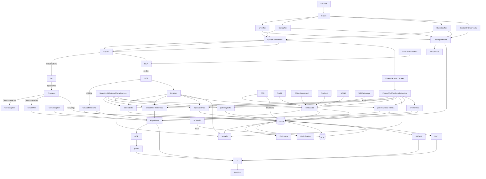

```mermaid
graph TD
  
  ONTOX-->Cases

  Cases-->LiverTox
  Cases-->KidneyTox
  Cases-->BrainDevTox
  
  LiverTox-->SystematicReview-->Sysrev
  KidneyTox-->SystematicReview-->Sysrev
  BrainDevTox-->SystematicReview-->Sysrev
  
  Sysrev-->|SBtabLabels| rsr
  rsr-->|SysrevAPI| Phymdos
  Phymdos-->|SBMLConverter| CellDesigner
  Phymdos-->|SBMLConverter| MINERVA
  Phymdos-->|GraphQL| ASPIS4j
  CellsDesigner-->PhysMaps
  MINERVA-->PhysMaps
  
  SystematicReview-->Phase1AbstractScreen
  Phase1AbstractScreen-->Phase2FullTextDataExtraction
  Sysrev-->NLP
  NLP-->|en-tox| NER
  NER-->|CREW| CausalRelations
  CausalRelations-->ASPIS4j[(ASPIS4j)]
  CausalRelations-->PhysMaps
  
  
  Phase2FullTextDataExtraction-->patientData
  Phase2FullTextDataExtraction-->clinicalChemistryData
  Phase2FullTextDataExtraction-->exposureData
  Phase2FullTextDataExtraction-->invitroData
  Phase2FullTextDataExtraction-->Models
  Phase2FullTextDataExtraction-->geneExpressionData
  Phase2FullTextDataExtraction-->animalData
  
  clinicalChemistryData-->PhysMaps
  invitroData-->PhysMaps
  geneExpressionData-->PhysMaps
  animalData-->PhysMaps
  
  PhysMaps-->AOP-->qAOP
  qAOP-->AI
  PhysMaps-->AI
  
  SelectionOfExternalDataSources-->patientData
  SelectionOfExternalDataSources-->clinicalChemistryData
  SelectionOfExternalDataSources-->exposureData
  SelectionOfExternalDataSources-->invitroData
  SelectionOfExternalDataSources-->Models
  SelectionOfExternalDataSources-->pathwayData
  
  PubMed-->patientData
  PubMed-->clinicalChemistryData
  PubMed-->exposureData
  PubMed-->invitroData
  PubMed-->Models
  NER-->PubMed
  
  LiverTox-->LabExperiments
  KidneyTox-->LabExperiments
  BrainDevTox-->LabExperiments
  LabExperiments-->inVitroData
  
  Cases-->SlectionOfChemicals-->LabExperiments
  LabExperiments-->ASPIS4j[(ASPIS4j)]
  
  CTD-->geneExpressionData
  CTD-->|BIOBricks| ASPIS4j
  Tox21-->invitroData
  EPAADashboard-->invitroData
  ToxCast-->invitroData
  NCI60-->invitroData
  
  LiverToxBookshelf-->NLP
  geneExpressionData-->ASPIS4j[(ASPIS4j)] 
  invitroData-->ASPIS4j[(ASPIS4j)]
  animalData-->ASPIS4j[(ASPIS4j)]
  patientData-->ASPIS4j[(ASPIS4j)]
  invitroData-->ASPIS4j[(ASPIS4j)]
  exposureData-->ASPIS4j[(ASPIS4j)]
  pathwayData-->ASPIS4j[(ASPIS4j)]
  ASPIS4j[(ASPIS4j)]-->Models
  ASPIS4j[(ASPIS4j)]-->EndUsers
  ASPIS4j[(ASPIS4j)]-->FAIRsharing
  ASPIS4j[(ASPIS4j)]-->RDF[(RDF)]
  RDF[(RDF)]-->ASPIS4j[(ASPIS4j)]
  AOPWiki-->|RDF| RDF[(RDF)]
  WikiPathways-->|RDF| pathwayData
  
  ASPIS4j[(ASPIS4j)]-->RASAR
  ASPIS4j[(ASPIS4j)]-->BNN
  RASAR-->AI
  BNN-->AI
  AI-->ProbRA
  
  
```
