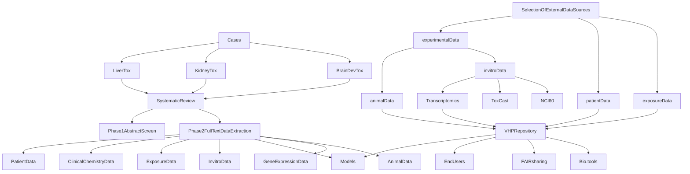

```mermaid
graph TD
  Cases-->LiverTox
  Cases-->KidneyTox
  Cases-->BrainDevTox
  LiverTox-->SystematicReview
  KidneyTox-->SystematicReview
  BrainDevTox-->SystematicReview
  SystematicReview-->Phase1AbstractScreen
  SystematicReview-->Phase2FullTextDataExtraction
  Phase2FullTextDataExtraction-->PatientData
  Phase2FullTextDataExtraction-->ClinicalChemistryData
  Phase2FullTextDataExtraction-->ExposureData
  Phase2FullTextDataExtraction-->InvitroData
  Phase2FullTextDataExtraction-->Models
  Phase2FullTextDataExtraction-->GeneExpressionData
  Phase2FullTextDataExtraction-->AnimalData
  SelectionOfExternalDataSources-->experimentalData
  invitroData-->Transcriptomics
  invitroData-->ToxCast
  invitroData-->NCI60
  SelectionOfExternalDataSources-->patientData
  SelectionOfExternalDataSources-->exposureData
  experimentalData-->animalData
  experimentalData-->invitroData
  animalData-->VHPRepository
  patientData-->VHPRepository
  Transcriptomics-->VHPRepository
  exposureData-->VHPRepository
  VHPRepository-->Models
  VHPRepository-->EndUsers
  VHPRepository-->FAIRsharing
  VHPRepository-->Bio.tools
```
