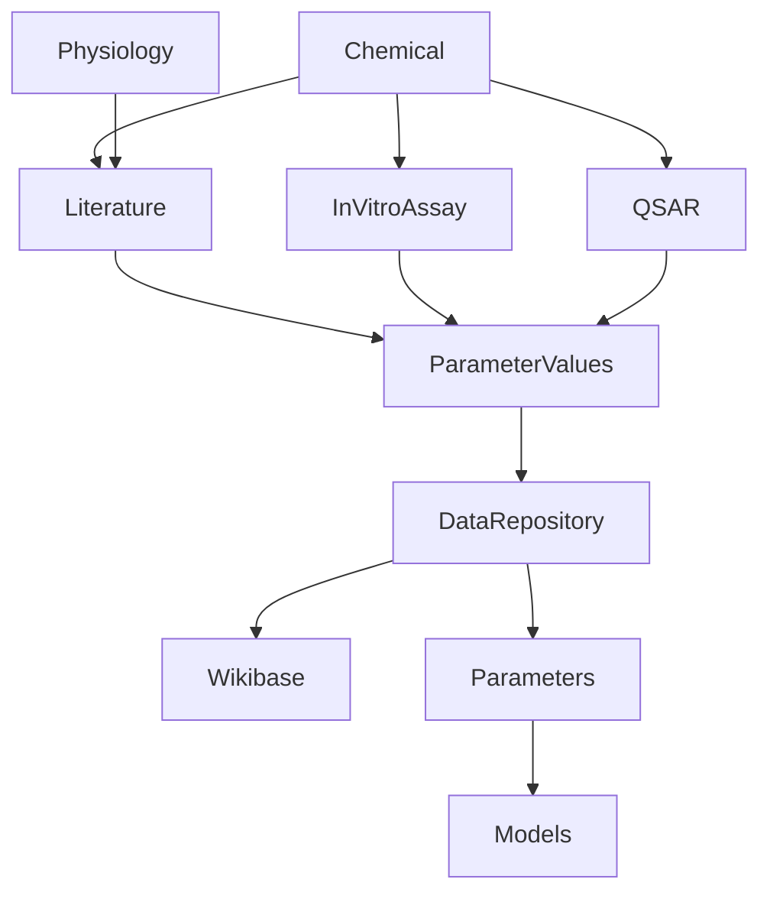

```mermaid
graph TD
  Chemical-->InVitroAssay
  Chemical-->QSAR
  Literature-->ParameterValues
  InVitroAssay-->ParameterValues
  Chemical-->Literature
  QSAR-->ParameterValues
  ParameterValues-->DataRepository
  Physiology-->Literature
  DataRepository-->Wikibase
  DataRepository-->Parameters
  Parameters-->Models
```
